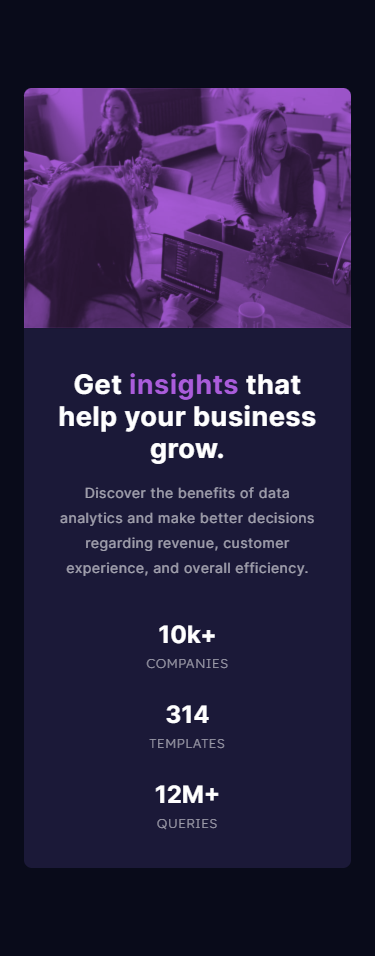

# Frontend Mentor - Stats preview card component solution

This is a solution to the [Stats preview card component challenge on Frontend Mentor](https://www.frontendmentor.io/challenges/stats-preview-card-component-8JqbgoU62).
 
Frontend Mentor challenges help you improve your coding skills by building realistic projects.

## Screenshot
 - Based on original desktop image (1440 x 800 px).
 - Based on original mobile image (375 x 956 px).

## The challenge
Users should be able to:
- View the optimal layout depending on their device's screen size.

## Built with
- HTML5
- CSS3

## Links
- Check out the live [example](https://dimmageiras.github.io/frontend-mentor-stats-preview-card-component).
- See the [solution](https://www.frontendmentor.io/solutions/html-css-flex-blendmode-gjuQkIVnl) on Frontend Mentor's website.

## Author
- [@dimmageiras](https://github.com/dimmageiras)
